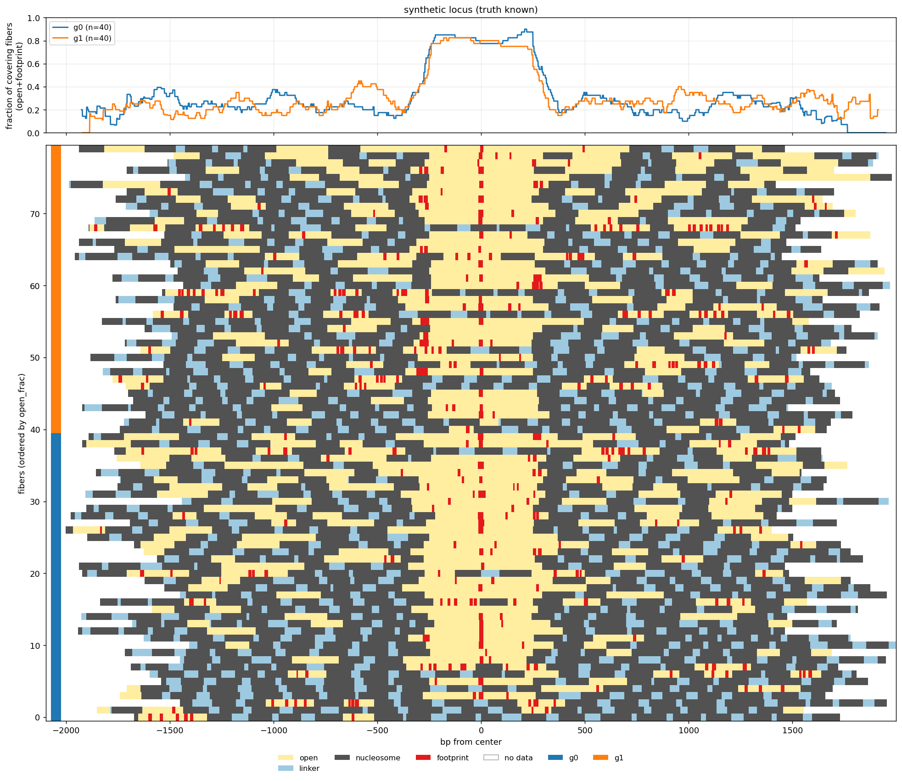
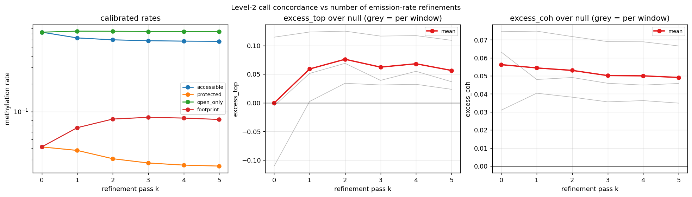

# hier_hmm

A two-level HMM that segments **single molecules** of methylation-footprinting data (Fiber-seq /
SMAC / dSMF style m6A calls) into chromatin states, one molecule at a time.

* **Level 1** — open / linker / nucleosome, across the whole molecule.
* **Level 2** — short protein footprints, searched inside Level-1 open runs at base-pair
  resolution.



Each row is a molecule: grey nucleosome, pale blue linker, yellow open, red footprint, white
where the read has no data. Top panel is the fraction of covering molecules called open.

## States and substates

Each state is expanded into a chain of **substates**, which is what lets a state have a length
distribution instead of a decay rate. A state with `k` substates that each exit with the same
probability has a peaked length distribution with mean `mean_bp` and SD a little under
`mean_bp / sqrt(k)`; an optional `min_bp` prefix of must-advance substates makes a hard floor and
tightens it further. So each state gives you three knobs — **mean, variance (via `k`), and
minimum** — and a nucleosome comes out at 129 ± 21 bp, never shorter than 60, rather than "most
likely 1 bp long".

**Level 1**, 5 bp bins:

| state | mean | substates `k` | minimum | resulting SD | emission class |
| --- | --- | --- | --- | --- | --- |
| open | 212 bp | 4 | — | 101 bp | accessible |
| linker | 49 bp | 3 | — | 24 bp | accessible |
| nucleosome | 129 bp | 6 | 60 bp | 21 bp | protected |

**Level 2**, 1 bp bins, run inside open runs (trimmed 15 bp at each end, minimum run 60 bp):

| state | mean | substates `k` | minimum | resulting SD | emission class |
| --- | --- | --- | --- | --- | --- |
| open | 50 bp | 1 | — | 50 bp | open_only |
| footprint | 15 bp | 3 | 8 bp | 3 bp | footprint |

Transitions between states are a grammar, and its zeros are hard:

| from | to |
| --- | --- |
| open | nucleosome (1.0) |
| linker | nucleosome (1.0) |
| nucleosome | linker (0.72), open (0.28) |

Open and linker share one emission rate — they are told apart by their lengths and by the
grammar, not by their signal. `hier-hmm check` prints the length distributions any config
actually implies; note that changing a bin size changes the variances, since `k` is fixed.

## Emission

Every callable position is binary: methylated or not. A bin holding `n` callable positions of
which `k` are methylated contributes `k·log(mu) + (n−k)·log(1−mu)`, where `mu` is the
methylation rate of the state's emission class. A bin with no callable positions contributes
nothing and the length prior carries it.

The four rates are calibrated from the data: a two-component binomial mixture for a starting
point, then re-estimated from the positions the current segmentation assigns to each class,
twice. On T-cell data that gives roughly `accessible` 0.60, `protected` 0.031, `open_only` 0.74,
`footprint` 0.083.

## Input

One `(n_fiber, n_pos)` float array, `m6a`:

| value | meaning |
| --- | --- |
| `NaN` | not callable — the read does not cover this position, or the base is not assayable |
| `0` | callable, unmethylated |
| `1` | callable, methylated |

Optionally in the same `.npz`: `coverage` (bool, read coverage as distinct from callability —
used only to find each molecule's usable span), `positions` and `center` for the plot axis, and
**any length-`n_fiber` array** (groups, cluster ids, read names), which rides through to the
output and can split the plot or order its rows.

## Use

```bash
pip install -e .                       # numpy, pyyaml, matplotlib — nothing else
python examples/quickstart.py          # simulate, annotate, plot; no data needed

hier-hmm init-config my.yaml           # a commented copy of every knob
hier-hmm check -c my.yaml              # what length distributions does this config imply?
hier-hmm run data.npz -c my.yaml -o out/ --group-by celltype
hier-hmm run data.npz --set level1.tau=0.7 --set binning.level1_bp=10
```

Without installing, `python -m hier_hmm ...` works from the repo root.

`run` writes `annotation.npz` (labels, per-bp footprint posterior, per-molecule metadata),
`annotation.calibration.json`, `annotation.config.yaml` (the resolved config, so a run is
reproducible from its own output) and `annotation.png`.

As a library:

```python
from hier_hmm import load_config, prepare, run

cfg = load_config("my.yaml")
res = run(prepare(m6a_array, cfg), cfg)
res.labels          # (n_fiber, n_bp) int8; -1 = no data
res.label_map       # {'open': 0, 'linker': 1, 'nucleosome': 2, 'footprint': 3}
res.rates           # calibrated rate per emission class
frac, cov = res.fraction("open", "footprint")
```

## Config

`hier_hmm/default_config.yaml` holds every prior, threshold and bin size, with the reasoning for
each in comments. The code has no second copy of any of them, and any key you pass that is not
already in the defaults is an error rather than a silent no-op.

Both levels decode by forward-backward posterior: a position is called by the threshold state
(`open` at Level 1, `footprint` at Level 2) when its posterior clears `tau`, otherwise it takes
the argmax of the rest. `tau` is the operating point — sweep it for a recall curve.
`decode: viterbi` gives the single best path instead.

### Why calibration runs twice

`hier_hmm.metrics` scores Level-2 calls as excess over a permutation null: Level 1 frozen, each
molecule's methylated positions re-placed within its own open runs, null called with the same
rates. On three T-cell loci, positional concentration of the footprint calls against the number
of calibration passes:

| pass `k` | 0 | 1 | **2** | 3 | 4 | 5 |
| --- | --- | --- | --- | --- | --- | --- |
| `excess_top` | −0.017 | +0.055 | **+0.079** | +0.064 | +0.060 | +0.061 |



Unrefined rates give calls *less* concentrated than the null. `k=2` is the best value and all
three loci agree on it, but the margin over `k=3` is ~0.015 against a between-locus spread of
~0.021 — so read this as "at least 2", with 3 an acceptable alternative. The footprint rate
itself settles by pass 2; what keeps drifting afterwards is `accessible` and `protected`. Run
`examples/refine_sweep.py` on your own windows to redo this.

## Tests

```bash
pytest                # or: python tests/test_hmm.py  — each file also runs standalone
```

27 tests: length distributions against what the config asked for, Viterbi and forward-backward
against brute-force enumeration of every path on small chains, config validation, end-to-end
recovery of a simulated path, and the concordance metrics.

## Limitations

* Molecules are treated as **independent** — nothing pools evidence across the ensemble at a
  locus.
* It is a **segmenter, not a generative model of an ensemble**: a "nucleosome" is a protected run
  of about the right length, not a rod with an excluded volume.
* **Sequence-blind**, and a renewal process — one state's position says nothing about the next
  beyond the grammar and the lengths.
* Calibration is EM-like but has no convergence guarantee; it is two re-estimation passes.

The defaults come from a Fiber-seq study of mouse T-cell loci. Re-tune them on your data — that
is what the config is for. Treat the calls as good proposals, not ground truth.

## License

MIT.
